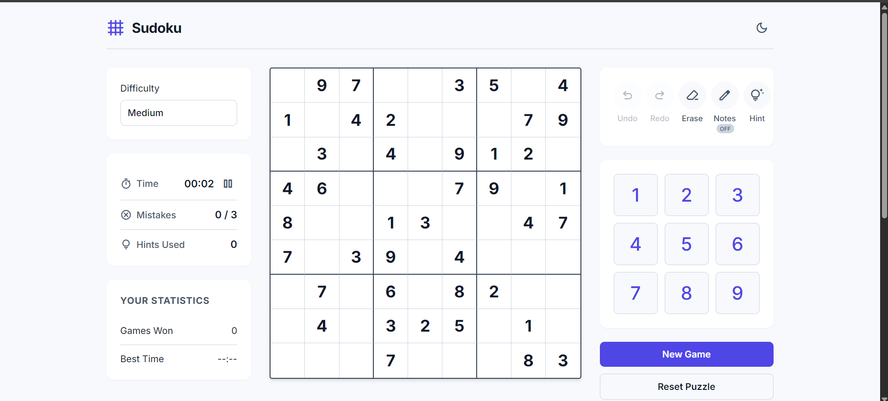
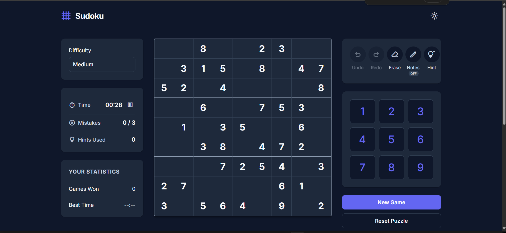

# 🧩 Modern Sudoku Game

A modern, responsive Sudoku web application built using **HTML**, **CSS**, and **Vanilla JavaScript**. The game features dynamic puzzle generation, multiple difficulty levels, dark mode, statistics tracking, and a clean user experience designed for desktop and mobile.

---

## 🌐 Live Demo

👉 **Live Demo:** https://modern-sudoku-lovat.vercel.app/

---

## 📸 Screenshots

> Add screenshots of your project here after deployment.

### ☀️ Light Mode



### 🌙 Dark Mode



---

## ✨ Features

- 🎯 Dynamic Sudoku puzzle generation
- 🧠 Backtracking Sudoku solver
- 📊 Five difficulty levels
  - Easy
  - Medium
  - Hard
  - Expert
  - Master
- 🌙 Dark Mode
- 💾 Local Storage support
- ⏱️ Game Timer
- ❌ Mistake Counter
- 💡 Hint System
- ✏️ Notes (Pencil Mode)
- ↩️ Undo & Redo
- 🧽 Erase Cell
- 🔄 Reset Game
- 🎲 New Random Game
- ✅ Check Solution
- 🏆 Custom Win Modal
- 📱 Fully Responsive Design
- ⌨️ Keyboard Support

---

## 🛠️ Built With

- HTML5
- CSS3
- Vanilla JavaScript
- Local Storage API

---

## 📂 Project Structure

```text
modern-sudoku/
│
├── index.html
├── style.css
├── script.js
├── README.md
└── assets/
    ├── screenshots/
    ├── icons/
    └── images/
```

---

## 🚀 Getting Started

### Clone the repository

```bash
git clone https://github.com/your-username/modern-sudoku.git
```

### Open the project

Simply open `index.html` in your browser.

Or use VS Code Live Server.

---

## 🎮 How to Play

1. Choose a difficulty level.
2. Click any empty cell.
3. Enter numbers using your keyboard or the on-screen number pad.
4. Each row, column, and 3×3 box must contain the numbers **1–9 exactly once**.
5. Use hints, notes, undo, and redo whenever needed.
6. Complete the board to win.

---

## 💡 Highlights

- Generates unique Sudoku puzzles dynamically
- Uses the Backtracking Algorithm to solve puzzles
- Automatically validates user moves
- Saves game progress using Local Storage
- Responsive design for desktop, tablet, and mobile

---

## 🔮 Future Improvements

- 🔊 Sound Effects
- 🎉 Confetti Animation
- 📈 More Detailed Statistics
- 🏅 Achievement System
- 📤 Share Score Feature
- 🎨 Multiple Themes

---

## 🤝 Contributing

Contributions, suggestions, and feedback are welcome.

Feel free to fork the repository and submit a pull request.

---

## 👨‍💻 Author

**Aditya Panna**

- GitHub: https://github.com/dev-adityap
- LinkedIn: https://linkedin.com/in/aditya-panna-0861662a3


---

## ⭐ Support

If you enjoyed this project, consider giving it a ⭐ on GitHub!

It really helps and motivates me to build more projects.

---

## 📜 License

This project is licensed under the MIT License.
